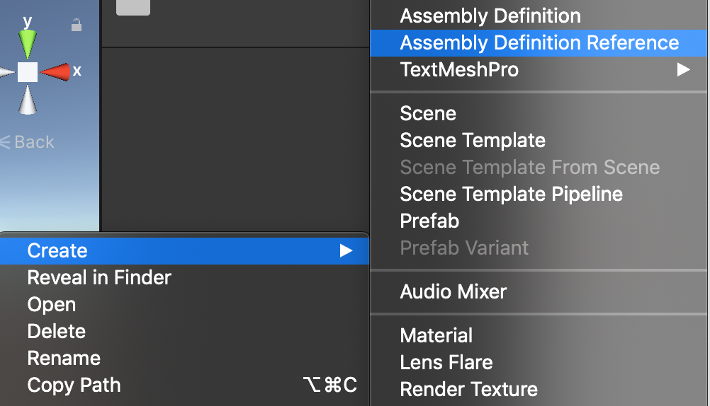
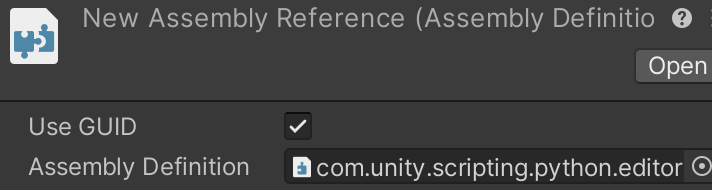

# Using the Python API

The [Python Script Editor](PythonScriptEditor.md) makes it easy to test
Python scripts and to create a menu item to allow users to easily
access the script.

In addition you can directly call Python from your C# scripts. Python Scripting
offers a high-level API and a low-level API.

## High-level API: PythonRunner.RunString
The following C# code will create a menu item that prints "hello world" in the
Unity console:

```
using UnityEditor.Scripting.Python;
using UnityEditor;

public class HelloWorld
{
    [MenuItem("Python/Hello World")]
    static void PrintHelloWorldFromPython()
    {
        PythonRunner.RunString(@"
                import UnityEngine;
                UnityEngine.Debug.Log('hello world')
                ");
    }
}
```

You can use any assembly that is available in C# by simply importing it with the
Python `import` statement -- in the example, we show importing `UnityEngine`.

## PythonRunner.RunFile
Instead of inlining your Python code inside of a C# script, you can execute a
whole Python script using the `PythonRunner.RunFile` method. For example, this
Python script loops over all the GameObjects in a scene and makes sure all the
names end up with an underscore:

```
import UnityEngine

all_objects = UnityEngine.Object.FindObjectsOfType(UnityEngine.GameObject)
for go in all_objects:
    if go.name[-1] != '_':
        go.name = go.name + '_'
```

Put this file in `Assets/ensure_naming.py`. Script files can be located
anywhere on your file system, they don't need to be in the project.
You can run this Python script from C# as follows:

```
using UnityEditor.Scripting.Python;
using UnityEditor;
using UnityEngine;

public class EnsureNaming
{
    [MenuItem("Python/Ensure Naming")]
    static void RunEnsureNaming()
    {
        PythonRunner.RunFile($"{Application.dataPath}/ensure_naming.py");
    }
}
```

## Low-level API

You can directly use Python for .NET, which wraps the CPython API. Using the C#
`dynamic` type, you can write C# that looks like Python. Refer to the [Python
for .NET documentation](https://pythonnet.github.io/).

There are some caveats:
* Make sure Python is properly initialized by calling `PythonRunner.EnsureInitialized()`.
* Always grab the CPython [Global Interpreter Lock (GIL)](https://docs.python.org/2/glossary.html#term-global-interpreter-lock).

Sample code:
```
using Python.Runtime;
using UnityEditor.Scripting.Python;

public class MyPythonScript
{
    [MenuItem("MyPythonScript/Run")]
    public static void Run()
    {
        PythonRunner.EnsureInitialized();
        using (Py.GIL()) {
            try {
                dynamic sys = Py.Import("sys");
                UnityEngine.Debug.Log($"python version: {sys.version}");
            } catch(PythonException e) {
                UnityEngine.Debug.LogException(e);
            }
        }
    }
}
```

You'll need to add an assembly reference in order for the compiler to know
where to find the low-level API in `Python.Runtime`. In the project view,
right-click and create a new assembly reference:


Then add a reference to `com.unity.scripting.python.editor`:


